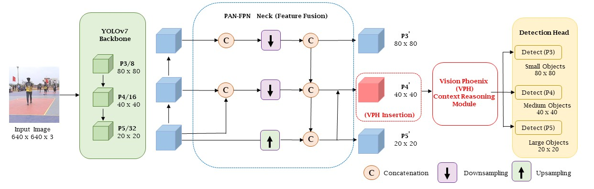
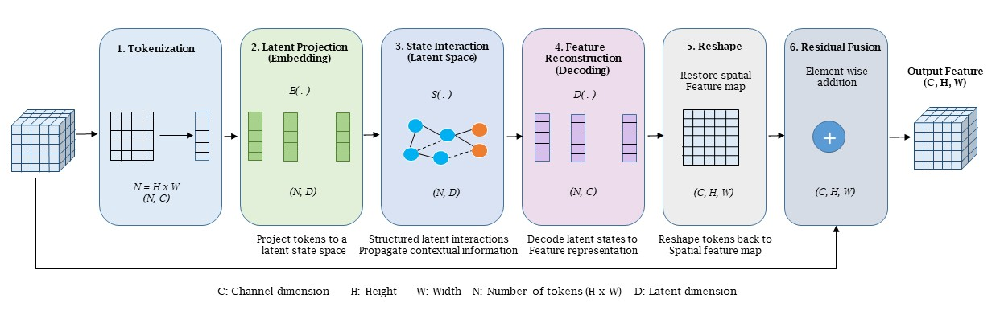

# Vision Phoenix (VPH)
## Efficient Latent-State Context Reasoning for Robust Pedestrian Detection
## Visual Surveillance and Biometrics Security Laboratory (ViBeS Lab) IIITDM Kancheepuram
<!-- <p align="center">

</p> -->

Official implementation of the paper:

**Vision Phoenix (VPH): Efficient Latent-State Context Reasoning for Robust Pedestrian Detection**

Submitted to **The Visual Computer (Springer Nature)**.

---

## Overview

Vision Phoenix (VPH) is a lightweight, attention-free latent-state context reasoning module designed to improve pedestrian detection under challenging real-world conditions. Unlike conventional attention mechanisms that explicitly compute pairwise feature interactions, VPH performs structured contextual reasoning within a compact latent-state space, enabling efficient global context modeling with minimal computational overhead.

The proposed module is detector-independent and can be seamlessly integrated into convolution-based object detection frameworks. In this work, VPH is validated using YOLOv7 as the baseline detector.

---

## Highlights

- ✅ Attention-free latent-state context reasoning
- ✅ Lightweight and computationally efficient
- ✅ Detector-independent module
- ✅ Robust under dense crowds and severe occlusion
- ✅ Effective in adverse weather and low-light environments
- ✅ Easy integration into existing object detectors

---

## Vision Phoenix Architecture

### Overall Framework

<p align="center">

</p>

VPH is integrated into the P4 feature level of the YOLOv7 PAN-FPN neck, where it refines intermediate feature representations before multi-scale pedestrian detection.

---

### Internal Architecture

<p align="center">

</p>

The VPH module performs context reasoning through six sequential stages:

1. Tokenization
2. Latent Projection
3. Latent-State Interaction
4. Feature Reconstruction
5. Reshape
6. Residual Fusion

---

## Repository Structure

```
Vision-Phoenix-VPH
│
├── cfg/
├── data/
├── docs/
├── examples/
├── models/
├── results/
├── scripts/
├── utils/
├── weifgts/
│
├── train.py
├── test.py
├── detect.py
├── export.py
│
├── requirements.txt
└── README.md
```

---

## Installation

Clone the repository

```bash
git clone https://github.com/Sukesh-babu/Vision-Phoenix-VPH.git

cd Vision-Phoenix-VPH
```

Install dependencies

```bash
pip install -r requirements.txt
```

---

## Dataset Preparation

The experiments were conducted using the following public pedestrian detection datasets.

| Dataset | Description |
|----------|-------------|
| COCO-Person | General pedestrian detection |
| WiderPerson | Crowded pedestrian detection |
| CamPedV2 | Diverse real-world pedestrian dataset |
| LLVIP | Low-light pedestrian detection (qualitative) |
| RTTS | Adverse weather (qualitative) |
| Foggy Cityscapes | Foggy scenes (qualitative) |
| CrowdHuman | Dense crowd analysis |
| UCSD | Pedestrian-like objects |

Please download the datasets from their official sources and configure the dataset paths in the corresponding YAML files.

---

## Training

```bash
python train.py \
--cfg cfg/training/yolov7_vph_P4.yaml \
--data data/V7_VPH.yaml \
--epochs 100
```

---

## Testing

```bash
python test.py \
--weights weights/vph.pt \
--data data/V7_VPH.yaml
```

---

## Inference

```bash
python detect.py \
--weights weights/vph.pt \
--source examples/images
```

---

## Experimental Settings

- Framework: PyTorch
- GPU: NVIDIA A100 PCIe 40GB
- Input Resolution: 640 × 640
- Epochs: 100
- Optimizer: SGD
- Batch Size: 16

---

## Results

The proposed Vision Phoenix (VPH) consistently improves pedestrian detection performance while maintaining computational efficiency across multiple benchmark datasets.

Representative qualitative results are available in:

```
results/
```

---

## Citation

If you find this repository useful, please cite:

```bibtex
@article{sukesh2026campedv2,
  title={CamPedV2: A Diverse Real-Time Pedestrian Detection Dataset for Challenging Environmental Conditions},
  author={Sukesh Babu, V. S. and Raman, Rahul},
  journal={The Visual Computer},
  volume={42},
  number={9},
  pages={351},
  year={2026},
  doi={10.1007/s00371-026-04566-z}
}
```

---

## License

This project is released under the MIT License.

---

## Contact

**Sukesh Babu V. S.**

Indian Institute of Information Technology Design and Manufacturing (IIITDM) Kancheepuram

Email:
cs22d0001@iiitdm.ac.in

---

## Acknowledgement

This repository is developed as part of the research on efficient context reasoning for robust pedestrian detection ViBeS Lab at IIITDM Kancheepuram.